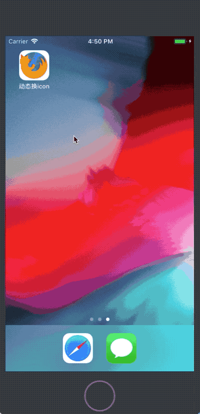
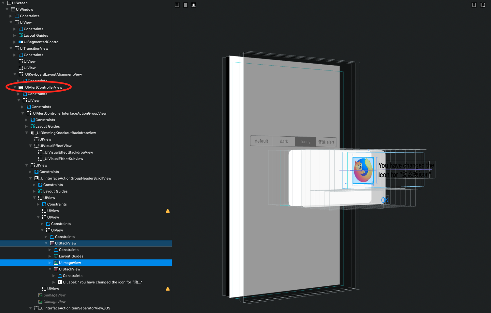
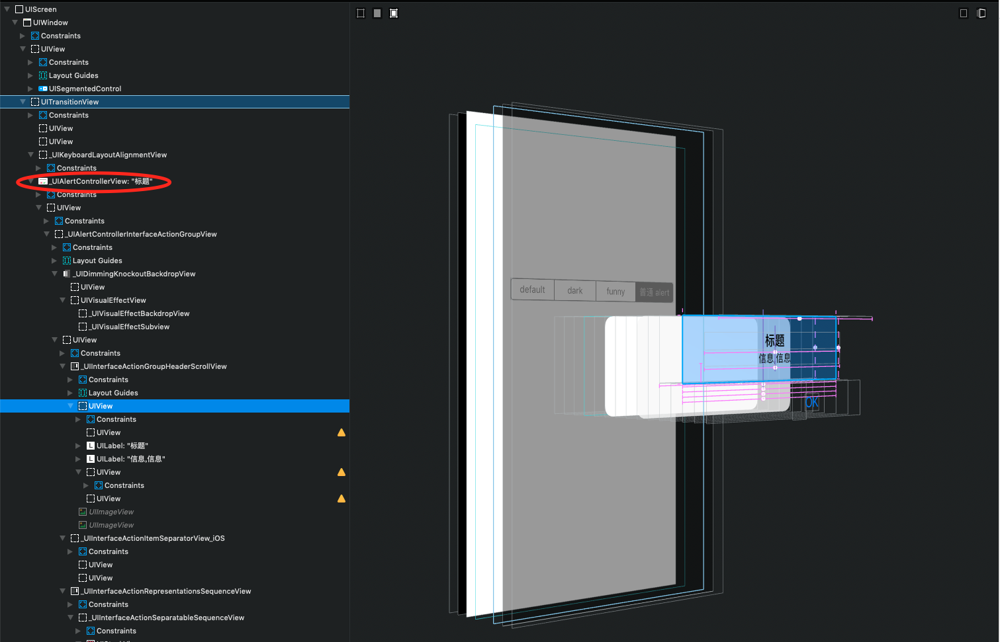

# 动态更换 APP icon 示例

## 动画示例



## 简介

系统要求：iOS 10.3+

## icon 生成

icon 生成：[图标工厂](https://icon.wuruihong.com)

## icon 的规格和存放位置

如果仅有 iPhone APP，则需要以下8种规格的图标：  

```
icon-20@2x.png
icon-20@3x.png
icon-29@2x.png
icon-29@3x.png
icon-40@2x.png
icon-40@3x.png
icon-60@2x.png
icon-60@3x.png
```

其中，`icon`是需要替换的名称，短横线后面的数字是图片的尺寸（单位：pt）。另外，`icon-1024.png`仅用于 `Assets.xcassets` 的 `AppIcon` 中，动态换 icon 时不需要。 可选 icon 图片的需要放在 `main bundle` 中，而不是 `Assets.xcassets` 中。  

准备好图片之后，需要在 `plist` 中添加相关配置，详情请查看这篇文章：[iOS 动态改变应用图标](https://blog.csdn.net/KimBing/article/details/77996756?utm_source=blogxgwz10)，或者直接参看本项目的 `plist`。  

最后，使用 `supportsAlternateIcons` 属性判断是否支持换 icon（plist 中是否有相关配置），如果支持，就可以使用`setAlternateIconName(_:completionHandler:)` 方法来执行 icon 更换。  

## 相关 API

```swift
extension UIApplication {

    // If false, alternate icons are not supported for the current process.
    @available(iOS 10.3, *)
    open var supportsAlternateIcons: Bool { get }

    
    // Pass `nil` to use the primary application icon. The completion handler will be invoked asynchronously on an arbitrary background queue; be sure to dispatch back to the main queue before doing any further UI work.
    @available(iOS 10.3, *)
    open func setAlternateIconName(_ alternateIconName: String?, completionHandler: ((Error?) -> Void)? = nil)

    
    // If `nil`, the primary application icon is being used.
    @available(iOS 10.3, *)
    open var alternateIconName: String? { get }
}
```

## API 文档

#### supportsAlternateIcons

The value of this property is true only when the system allows you to change the icon of your app. To declare your app's alternate icons, include them in the CFBundleIcons key of your app's Info.plist file.

#### setAlternateIconName(_:completionHandler:)

`alternateIconName`  
The name of the alternate icon, as declared in the `CFBundleAlternateIcons` key of your app's Info.plist file. Specify nil if you want to display the app's primary icon, which you declare using the `CFBundlePrimaryIcon` key. Both keys are subentries of the `CFBundleIcons` key in your app's Info.plist file.  

`completionHandler`  
A handler to be executed with the results. After attempting to change your app's icon, the system reports the results by calling your handler. (The handler is executed on a UIKit-provided queue, and not necessarily on your app's main queue.)   

#### alternateIconName

When the system is displaying one of your app's alternate icons, the value of this property is the name of the alternate icon (from your app's Info.plist file). When the system is displaying your app's primary icon, the value of this property is nil.

## 无弹框更换 APP 图标

更换 icon 后，系统会有一个弹框，提示 icon 发生了变化。这个弹框就是一个比较特殊的 `UIAlertViewController`：  



普通的 `UIAlertViewController` 是这样的：  



可以看出**更换 icon 的弹框**没有 title 和 message。我们可以据此将**更换 icon 的弹框**和**普通弹框**区分开（一般我们也不会弹出一个不含 title 和 message 的弹框，对吧）。   

如果换 icon 时不想让系统弹框，可以 hook `UIViewController` 的 `present(_:animated:completion:)` 方法，如果用 OC 写，直接在 `load`  中做 `method swizzling` 即可：  

```objc
#import "UIViewController+Present.h"
#import <objc/runtime.h>
@implementation UIViewController (Present)
+ (void)load {
    static dispatch_once_t onceToken;
    dispatch_once(&onceToken, ^{
        Method presentM = class_getInstanceMethod(self.class, @selector(presentViewController:animated:completion:));
        Method presentSwizzlingM = class_getInstanceMethod(self.class, @selector(dy_presentViewController:animated:completion:));
        // 交换方法实现
        method_exchangeImplementations(presentM, presentSwizzlingM);
    });
}
- (void)dy_presentViewController:(UIViewController *)viewControllerToPresent animated:(BOOL)flag completion:(void (^)(void))completion {
    
    if ([viewControllerToPresent isKindOfClass:[UIAlertController class]]) {
        NSLog(@"title : %@",((UIAlertController *)viewControllerToPresent).title);
        NSLog(@"message : %@",((UIAlertController *)viewControllerToPresent).message);
        
        UIAlertController *alertController = (UIAlertController *)viewControllerToPresent;
        if (alertController.title == nil && alertController.message == nil) {
            return;
        } else {
            [self dy_presentViewController:viewControllerToPresent animated:flag completion:completion];
            return;
        }
    }
    
    [self dy_presentViewController:viewControllerToPresent animated:flag completion:completion];
}
@end
```

## Swift4 中的 Method Swizzling

如果用 `Swift` 写，过程将比较曲折，因为 `load` 和 `initialize` 方法在 `Swift 4` 上使用会报错：  

```
Method 'initialize()' defines Objective-C class method 'initialize', which is not permitted by Swift

Method 'load()' defines Objective-C class method 'load', which is not permitted by Swift
```

实际上，`load` 方法在 `Swift 1.2` 就不能使用了，而 `initialize` 方法在 `Swift 3.2` 被标识为了过期。  

为了解决这个问题，只能用其他途径了。我参考了网上的一个示例： [在Swift4中实现Method Swizzling](http://blog.yaoli.site/post/如何优雅地在Swift4中实现Method-Swizzling)，而此示例是参考的国外的这篇博客：[Handling the Deprecation of initialize](http://jordansmith.io/handling-the-deprecation-of-initialize/)，其主要思想是：  

> The goal was to define an easy way for classes to adopt a function, and have that function called before the class is used.
 
也就是说，解决方案的核心思想就是让`类`实现一个`方法`，然后让这个`方法`在`类`使用前被调用。这样就能在这个`方法`中做 `Method Swizzling` 了。具体写法请参看上述博客或本项目。  

## 参考资料

**动态改变应用图标**：  

[iOS 动态改变应用图标](https://blog.csdn.net/KimBing/article/details/77996756?utm_source=blogxgwz10)

[About Info.plist Keys and Values](https://developer.apple.com/library/archive/documentation/General/Reference/InfoPlistKeyReference/Introduction/Introduction.html#//apple_ref/doc/uid/TP40009247)

[CFBundleIcons](https://developer.apple.com/library/archive/documentation/General/Reference/InfoPlistKeyReference/Articles/CoreFoundationKeys.html#//apple_ref/doc/uid/TP40009249-SW13)

**无弹框换 icon 及 Swift 中的 Method swizzling**：  

[无弹框更换App图标](http://daiyi.pro/2017/05/01/ChangeYourAppIcons2/)

[Method Swizzling](https://nshipster.com/method-swizzling/)

[在Swift4中实现Method Swizzling](http://blog.yaoli.site/post/如何优雅地在Swift4中实现Method-Swizzling)

[Handling the Deprecation of initialize](http://jordansmith.io/handling-the-deprecation-of-initialize/)

